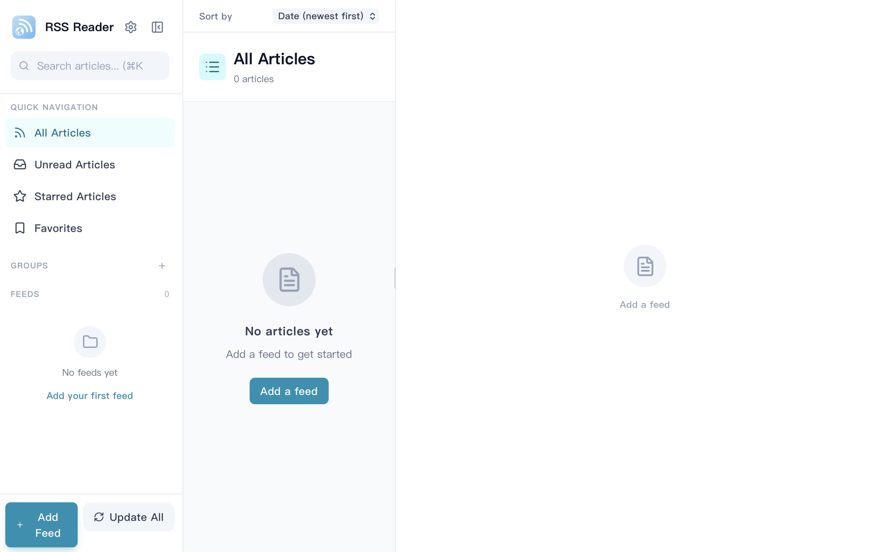

<div align="right">
  <a href="README.md">English</a> |
  <a href="README_zh.md">简体中文</a> |
  <a href="README_ru.md">Русский</a> |
  <a href="README_es.md">Español</a> |
  <a href="README_fr.md">Français</a> |
  <strong>العربية</strong>
</div>

<p align="center">
  
</p>

<h1 align="center">RSS Reader</h1>

<p align="center">
  <strong>قارئ RSS لسطح المكتب مدعوم بالذكاء الاصطناعي مع أولوية للتخزين المحلي. بدون سحابة. بدون تتبع. فقط خلاصاتك.</strong>
</p>

<p align="center">
  <a href="https://github.com/WangJinxin-flab/RSS-Reader/releases"></a>
  
  <a href="https://tauri.app/"></a>
</p>

<p align="center">
  <a href="#لماذا-rss-reader">لماذا RSS Reader؟</a> •
  <a href="#الميزات">الميزات</a> •
  <a href="#تنزيل">تنزيل</a> •
  <a href="#التكنولوجيا-المستخدمة">التكنولوجيا المستخدمة</a> •
  <a href="#التطوير">التطوير</a>
</p>

---

**لقطة شاشة**


## لماذا RSS Reader؟

في عالم مليء بخدمات الاشتراك والمزامنة السحابية، يتخذ **RSS Reader** نهجًا مختلفًا. إنه تطبيق سطح مكتب حديث يحتفظ بجميع بياناتك بشكل صارم على جهازك المحلي. بفضل دعمه بواسطة Tauri و Rust، فإنه يتميز بسرعته الفائقة وكفاءته في استخدام الذاكرة، ويدمج الذكاء الاصطناعي بشكل عميق لتعزيز تجربة القراءة الخاصة بك.

## الميزات

### القراءة وإدارة الخلاصات
- **دعم شامل:** اشترك بسلاسة في خلاصات RSS و Atom و JSON.
- **مزامنة ذكية:** مزامنة تزايدية باستخدام ترويسات `ETag` و `Last-Modified` لتوفير عرض النطاق الترددي.
- **دعم OPML:** استيراد وتصدير قوائم الخلاصات بسهولة.
- **قراءة غامرة:** وضع قراءة نظيف، شريط تقدم، وجدول محتويات ديناميكي.
- **الأولوية للوسائط:** مقاطع الفيديو المضمنة من YouTube و Bilibili تعمل مباشرة دون إعداد.

### تكامل الذكاء الاصطناعي
- **ملخصات ذكية:** إنشاء ملخصات المقالات تلقائيًا باستخدام واجهات برمجة التطبيقات OpenAI أو Anthropic.
- **ترجمة بنقرة واحدة:** ترجمة مقالات كاملة بشكل أصلي دون مغادرة التطبيق.
- **قواعد الأتمتة:** بناء قواعد قوية مدعومة بالذكاء الاصطناعي (مثل: "تمييز المقالات بنجمة تلقائيًا إذا كانت درجة صلة الذكاء الاصطناعي > 80").

### تجربة سطح المكتب الأصلية
- **تخزين مؤقت محلي:** بروتوكول مخصص `rss-media://` يقوم بتخزين الصور ومقاطع الفيديو المتدفقة محليًا بشكل آمن للعرض في وضع عدم الاتصال.
- **أداء عالي:** قوائم افتراضية (`react-virtuoso`) تتعامل مع آلاف المقالات بسهولة.
- **للمستخدمين المتقدمين:** اختصارات لوحة مفاتيح شاملة وعامة للتنقل بدون ماوس.
- **السمات:** سمات داكنة وفاتحة تتوافق مع النظام.
- **متعدد اللغات:** متوفر باللغات العربية، الصينية، الإنجليزية، الفرنسية، الروسية، والإسبانية.

## تنزيل

تتوفر الملفات التنفيذية الجاهزة للاستخدام من خلال [GitHub Releases](https://github.com/WangJinxin-flab/RSS-Reader/releases).

> [!TIP]
> **التحديث**
> يدعم التطبيق التحديثات التلقائية بشكل أصلي من خلال Tauri. بمجرد التثبيت، سيتم إعلامك بالإصدارات الجديدة تلقائيًا.

## التكنولوجيا المستخدمة

يستفيد هذا المشروع من لغات الويب والأنظمة الحديثة لتقديم تطبيق أصلي خفيف الوزن:

- **الأساس:** [Tauri 2.0](https://v2.tauri.app/) + [Rust](https://www.rust-lang.org/)
- **الواجهة الأمامية:** [React 18](https://react.dev/) + [TypeScript](https://www.typescriptlang.org/)
- **الأنماط:** [Tailwind CSS](https://tailwindcss.com/)
- **إدارة الحالة:** [Zustand](https://docs.pmnd.rs/zustand/)
- **قاعدة البيانات:** SQLite (مدمجة عبر `rusqlite`)

## التطوير

### المتطلبات الأساسية
- [Node.js](https://nodejs.org/) (v18+)
- [Rust](https://www.rust-lang.org/tools/install) (v1.70+)

### البدء السريع

```bash
# 1. استنساخ المستودع
git clone https://github.com/your-username/rss-reader.git
cd rss-reader

# 2. تثبيت تبعيات الواجهة الأمامية
npm install

# 3. تشغيل خادم التطوير (الواجهة الأمامية + الواجهة الخلفية Rust)
npm run tauri:dev
```

### أوامر مفيدة

| الأمر | الوصف |
|---------|-------------|
| `npm run tauri:build` | بناء حزمة تطبيق الإصدار |
| `npm run dev`         | تشغيل الواجهة الأمامية Vite فقط (بدون الواجهة الخلفية Rust) |
| `npm test`            | تشغيل اختبارات الواجهة الأمامية (Vitest) |
| `cargo test`          | تشغيل اختبارات الواجهة الخلفية (Rust) |
| `npm run lint`        | تشغيل ESLint |

### نظرة عامة على الهيكلية
يستخدم التطبيق فصلًا واضحًا للاهتمامات عبر Tauri's IPC (`invoke`):
- `src-tauri/src/db/`: عمليات SQLite المعيارية (الخلاصات، العلامات، المجموعات، القواعد).
- `src-tauri/src/feed/`: تحليل الخلاصات باستخدام `feed-rs`.
- `src/stores/`: مخازن Zustand المحفوظة في LocalStorage للحالة العامة.
- `src/components/`: مكونات React المعيارية لواجهة المستخدم.